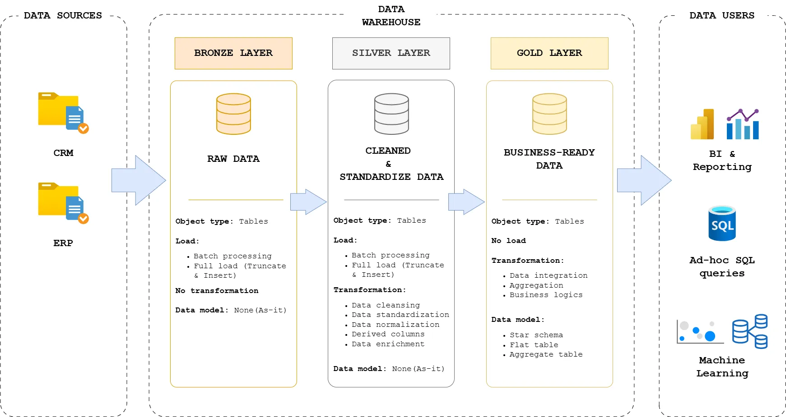
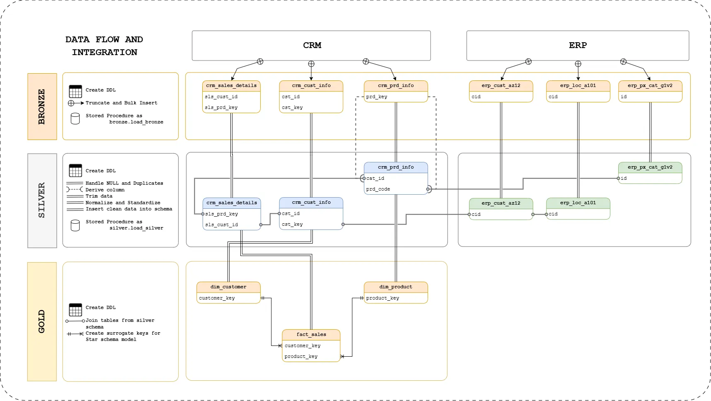

# SQL Data Warehouse Project


Welcome to my **SQL Data Warehouse Project** repository. This project showcase my end-to-end process of building a data warehouse for business from raw data by applying knowledge in ETL (Extract, Transform, and Load) and advance query functions in SQL Server.


---
## Overview

### Project Background:

**SportX Ltd Co** - a leading sport good retailer, specializes in design, manufacture, and distribute products for various sports and activities, focusing on affordability and quality. In order to align with digital transformation goal of the company, SportX require **a system where relevant data can be stored, updated, used for business-decision making and strategic planning**. As a Data Engineer, I was assigned to run a project to **build a data warehouse** that helps SportX meet the goal and accelerate the business operation process.

### Objective:

Develop a modern data warehouse to consolidate sales data, enabling analytical reporting and informed decision-making across departments (Sales, Marketing, Supply Chain).

### Specifications:

- **Data sources**: Import data from two sources (ERP and CRM) provided as CSV files.
-	**Data quality**: Cleanse and resolve data quality issues prior to analysis.
- **Integration**: Combine both sources into a user-friendly data model for analytical queries.
-	**Scope**: Focus on the latest dataset only; historization of data is not required. 
-	**Documentation**: Provide clear data model documentation to support both business stakeholders and analytics teams.

## Methodology

### Data Architect Design

This data warehouse follows Medallion Architecture &rarr; Designing a data warehouse with 3 layers entitled as **`Bronze`**, **`Silver`**, and **`Gold`**:
|                 | Bronze layer                                      | Silver layer                                            | Gold layer                                           |
| :-------------- | :------------------------------------------------ | :------------------------------------------------------ | :--------------------------------------------------- |
| **Definition** | Raw, unprocessed data as-is from sources          | Clean & standardized data                               | Business-ready data                                  |
| **Objective** | Traceability & Debugging                          | (Intermediate layer) Prepare Data for analysis          | Provide data to be consumed for reporting & analytics |
| **Object type** | Tables                                            | Tables                                                  | Views only                                           |
| **Stakeholders**| Data Engineer                                     | Data Engineer <br> Data Analyst                         | Data Analyst <br> Business stakeholder               |



1. **Bronze Layer**: Stores raw data as-is from the source systems (CRM and ERP). Data is ingested (Truncate and Bulk Insert) from CSV Files into SQL Server Database.
2. **Silver Layer**: Conducts full ETL process includes data cleansing, standardization, and normalization processes to prepare data for analysis.
3. **Gold Layer**: Integrates data into business-ready data sources required for reporting and analytics (following star schema model).



## 📂 Repository Structure
```
data-warehouse-project/
│
├── datasets/                           # Raw CRM and ERP datasets used for the project
│
├── docs/                               # Project documentation and architecture details
│   ├── data_architecture.webp          # Webp file shows the project's architecture
│   ├── data_catalog.md                 # Catalog of datasets, including field descriptions and metadata
│   ├── data_flow.webp                  # Webp file for the data flow diagram
│   ├── naming-conventions.md           # Consistent naming guidelines for tables, columns, and files
│
├── scripts/                            # SQL scripts for ETL and transformations
│   ├── bronze/                         # Scripts for extracting and loading raw data
│       ├── bronze_ddl
│       ├── bronze_load_proc 
│   ├── silver/                         # Scripts for cleaning and transforming data
│       ├── silver_ddl
│       ├── silver_load_proc
│   ├── gold/                           # Scripts for creating analytical models
│       ├── gold_ddl
│
├── tests/                              # Test scripts and quality files
│
├── README.md                           # Project overview and instructions
├── LICENSE                             # License information for the repository
└── .gitignore                          # Files and directories to be ignored by Git
 
```
